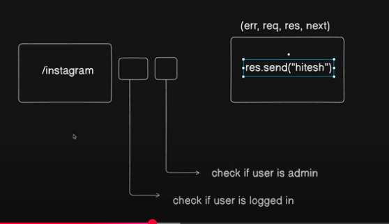

# Middleware 



Okay, let's simplify those Express middleware notes even further. Imagine middleware as a series of checkpoints a request goes through on your server.

-----

# Express Middleware: Simplified Notes

Think of your Express server as a processing line for every incoming request (like someone asking for a webpage or data). **Middleware functions** are the workers on this line.

## What is Middleware?

  * It's a function that runs **between** when your server gets a request and when it sends back a final response.
  * It's like a **checkpoint** where you can do things before the request moves on.

## What can a Middleware Worker Do?

Each middleware function can:

1.  **Look at the request:** Check details like what URL was asked for, what method was used (GET, POST), or any data sent.
2.  **Change the request or response:** Add new info to the request, or set up things for the response.
3.  **Do some work:** Like log something, check if a user is logged in, or scramble a password.
4.  **Decide what's next:**
      * **Pass it on (`next()`):** Send the request to the *next* worker (middleware) in the line. This is the most common action.
      * **End the line:** Send a response back to the client immediately (e.g., `res.send('Done!')`). If this happens, no more workers or routes will run for that request.

## Example of a Middleware Worker:

Imagine a security guard and a logging clerk:

```javascript
// A simple logging middleware
const logger = (req, res, next) => {
  console.log(`Request came in at: ${new Date().toLocaleTimeString()} for ${req.url}`);
  next(); // IMPORTANT: Pass the request to the next step!
};

// A simple authentication checker middleware
const checkAuth = (req, res, next) => {
  if (req.headers.authorization === 'my-secret-token') {
    console.log('User is authorized!');
    next(); // User is good, let them continue
  } else {
    res.status(401).send('Unauthorized!'); // Stop here, don't let them pass!
  }
};

// In your main Express app (app.js or index.js):
const express = require('express');
const app = express();

app.use(logger);       // Every request goes through the logger first
app.use('/admin', checkAuth); // ONLY requests to /admin (or its sub-paths) go through checkAuth

app.get('/', (req, res) => {
  res.send('Welcome to the homepage!');
});

app.get('/admin/dashboard', (req, res) => {
  res.send('Welcome to the Admin Dashboard!'); // Only reachable if checkAuth passes
});

app.listen(3000, () => console.log('Server running on port 3000'));
```

## Common Types of Middleware You'll Use:

1.  **Built-in Express Middleware:**

      * `express.json()`: Automatically takes incoming JSON data from your frontend and puts it into `req.body`. (So you can do `req.body.username`).
      * `express.static('public')`: Serves up static files like your images, CSS, or frontend React app.

2.  **Third-Party Middleware (from `npm install`):**

      * `cors`: Allows your frontend (e.g., `localhost:3000`) to talk to your backend (e.g., `localhost:5000`). Without this, web browsers would block the communication for security.
      * `cookie-parser`: Helps your server read and set cookies from the browser.
      * `multer`: Specifically designed to handle file uploads (like when a user uploads a profile picture).
      * `dotenv`: (Technically not middleware, but very related). It loads your secret keys (like database passwords) from a `.env` file so they aren't hardcoded in your public code.
      * `nodemon`: (Also not middleware). This is a development tool that automatically restarts your server when you change your code.

## Why Use Middleware?

  * **Organized Code:** Keeps specific tasks (like logging or authentication) separate and clean.
  * **Reusability:** Write a middleware function once and use it for many different routes.
  * **Control:** Gives you fine-grained control over how each request is handled before it reaches your main route logic.

Middleware is a powerful and essential part of building robust Express applications\!