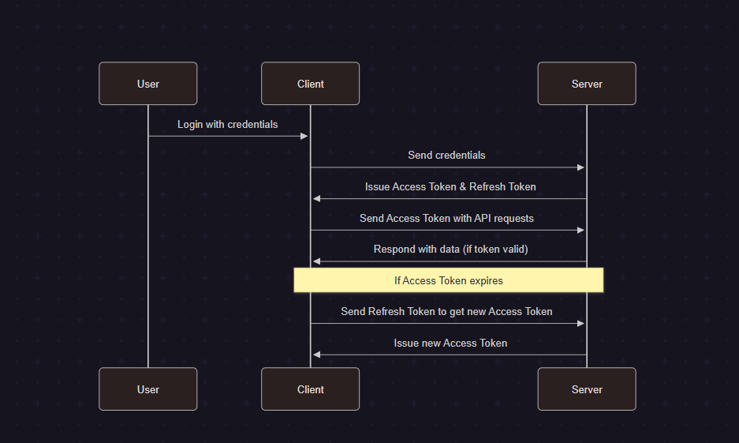

# JSON Web Token (JWT)

**JWT (JSON Web Token)** is a compact, URL-safe way to represent claims between two parties. It is commonly used for authentication and authorization in web applications.

## Use Case

JWTs are used to securely transmit information between a client (browser/app) and a server. They are most often used for:
- **Authentication:** Verifying user identity after login.
- **Authorization:** Granting access to protected resources based on user roles.

## How JWT Works

1. **User Logs In:**  
   The client sends login credentials to the server.

2. **Server Issues JWT:**  
   If credentials are valid, the server creates a JWT and sends it to the client.

3. **Client Stores JWT:**  
   The client stores the JWT (usually in localStorage or a cookie).

4. **Client Sends JWT:**  
   For each request to a protected route, the client sends the JWT in the request header.

5. **Server Verifies JWT:**  
   The server verifies the JWT. If valid, it processes the request.

---

## Access Token vs Refresh Token

- **Access Token:**  
  Short-lived token used to access protected resources. Sent with each API request.
- **Refresh Token:**  
  Long-lived token used to obtain a new access token when the old one expires. Usually stored securely and sent only to a special endpoint.

  


---

## JWT Structure

A JWT consists of three parts:
1. **Header:** Type of token and signing algorithm.
2. **Payload:** Claims/data (e.g., user ID, role).
3. **Signature:** Verifies the token hasn’t been altered.

Example:
```
eyJhbGciOiJIUzI1NiIsInR5cCI6IkpXVCJ9
.eyJ1c2VySWQiOiIxMjM0Iiwicm9sZSI6ImFkbWluIn0
.sflKxwRJSMeKKF2QT4fwpMeJf36POk6yJV_adQssw5c
```

## What if the Refresh Token Expires?

If the **refresh token** expires, the user can no longer obtain new access tokens automatically. This means:

- The user must log in again with their credentials.
- The server will issue a new access token and refresh token after successful authentication.
- This process helps maintain security by ensuring long-lived sessions are periodically re-validated.

**Summary:**  
When a refresh token expires, the user is required to re-authenticate to continue

---

## Summary

- JWTs are widely used for stateless authentication and authorization.
- Access tokens are for API requests; refresh tokens are for getting new