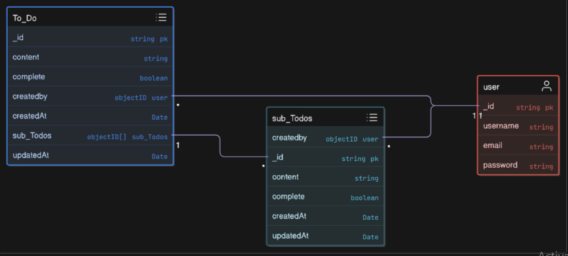

# TO DO app Data moddeling 



## user.models.js 

```js
import mongoose from 'mongoose';

const UserSchema = new mongoose.Schema(
  {
    username: {
      type: String,
      required: true,
      unique: true,
      lowercase: true,
    },
    email: {
      type: String,
      required: true,
      unique: true,
      lowercase: true,
    },
    password: {
      type: String,
      required: true,
    },
  },
  { timestamps: true }
);

export const User = mongoose.model('User', UserSchema);


```


## Todo.models.js


```js
import mongoose from "mongoose"


const TodoSchema = new mongoose.Schema({

  content:{
    type:String,
    required:true


  },

  complete:{
    type: Boolean,
    default : false


  },

  createdBY:{
    type: mongoose.Schema.Types.ObjectId,
    ref : "User"
  
  },

  SubTodo:[
    {
      type :mongoose.Schema.Types.ObjectId,
      ref: "SubTodo"
    }
  ]


},{timestamps:true})

export const Todo = mongoose.model("Todo", TodoSchema) 
```

## SubTodo.model.js

```js
import mongoose from " mongoose "

const subTodoSchema = new mongoose.Schema({

  content:{
    type:String,
    required:true


  },

  complete:{
    type: Boolean,
    default : false


  },

  createdBY:{
    type: mongoose.Schema.Types.ObjectId,
    ref : "User"
  
  }

},{timestamps:true})

export const SubTodo = mongoose.model("SubTodo",subTodoSchema)

```