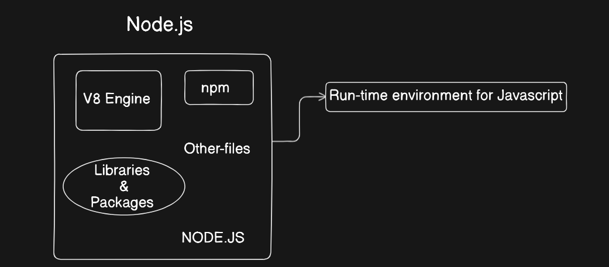
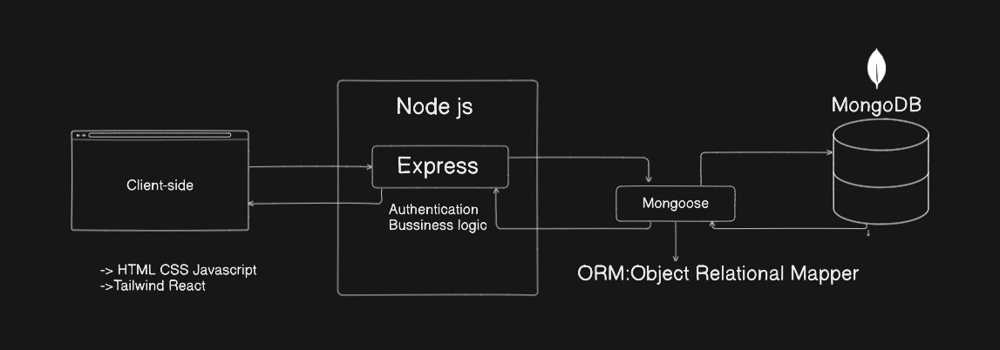

# Js based backend 

# JavaScript based Backend 
## JavaScript :
JavaScript is a programming language and core technology of the web along with HTML CSS .

JavaScript was initially created to “make web pages alive”.

The programs in this language are called scripts. They can be written right in a web page’s HTML and run automatically as the page loads.

Scripts are provided and executed as plain text. They don’t need special preparation or compilation to run.

#### Today, JavaScript can execute not only in the browser, but also on the server, or actually on any device that has a special program called the JavaScript engine.

# Node.JS 
Node.js is a cross-platform, open-source JavaScript runtime environment that can run on Windows, Linux, Unix, macOS, and more.
- Node.js runs on the V8 JavaScript engine, and executes JavaScript code outside a web browser.

- Node.js lets developers use JavaScript to write command line tools and for server-side scripting. The ability to run JavaScript code on the server is often used to generate dynamic web page content before the page is sent to the user's web browser.
-  Consequently, Node.js represents a "JavaScript everywhere" paradigm, unifying web-application development around a single programming language, as opposed to using different languages for the server- versus client-side programming.

Node.js has an event-driven architecture capable of asynchronous I/O. These design choices aim to optimize throughput and scalability in web applications with many input/output operations, as well as for real-time Web applications (e.g., real-time communication programs and browser games)

## Js based backend 

## Web Frameworks

Server-side web frameworks (a.k.a. "web application frameworks") are software frameworks that make it easier to write, maintain and scale web applications.

They provide tools and libraries that simplify common web development tasks, including routing URLs to appropriate handlers, interacting with databases, supporting sessions and user authorization, formatting output (e.g. HTML, JSON, XML), and improving security against web attacks.

        Express-> Node.js/js
        Django-> Python
        Larvel-> php
        ruby on rails-> ruby
        Flask -> Python
        Spring boot -> Java

## Express Web Framework
Express is a popular web framework, written in JavaScript and hosted within the Node.js runtime environment. 

## MERN Stack
        -> MongoDB/MySQL
        -> Express
        -> React 
        -> Nodejs

