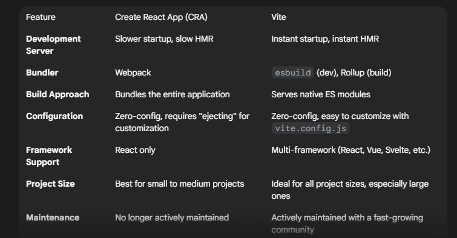

# React Js 
React JS is a popular JavaScript library for building user interfaces. It's used by a lot of companies for creating single-page applications where the content updates dynamically without needing to reload the whole page.

React js -> JS library 

    -> React-Dom -> Web 
    -> React-Native -> Mobile 

## React creates Single Page Application 

A single-page application (SPA) is a web application or website that loads a single HTML page and then dynamically rewrites that page as the user interacts with it. Instead of loading a brand new page from the server for every action, the SPA uses JavaScript to update the content and the user interface.

Here are the key characteristics and benefits of SPAs:

Faster and more fluid user experience: Once the initial page has loaded, subsequent interactions are much quicker because the browser only needs to fetch new data, not an entire new page. This makes the website feel more like a native desktop or mobile application.

Reduced server requests: By only requesting the necessary data (often in a format like JSON), SPAs reduce the amount of data transferred between the client and the server, which can improve performance and lower server load.

Separation of concerns: SPAs encourage a decoupled architecture where the front-end (client-side) and back-end (server-side) can be developed independently. The back-end becomes a data provider (an API), and the front-end handles all the rendering and user interface logic.

Examples: Many popular web applications are SPAs, including Gmail, Google Maps, Netflix, and Trello.

SPAs are a significant departure from traditional multi-page applications (MPAs), which require a full page refresh for every navigation or content change. While SPAs offer many advantages, they can also present challenges, such as a more complex initial setup, potential issues with search engine optimization (SEO) due to their dynamic nature, and the need for more advanced state management on the client-side

# How  to start the react project 

To put it simply, Create React App (CRA) and Vite are both tools that help you get a React project up and running without a lot of manual configuration. They are like a pre-packaged starter kit.

1. `Create React App` is the more traditional, officially-supported way to start a React project, created by Facebook. It's been around for a while and has a massive community.

2. `Vite` (pronounced "veet") is a newer, faster build tool that has gained a lot of popularity.

## CRA vs Vite 

## conclusion 

For new React projects, Vite is the clear winner. Its superior performance, modern architecture, and developer-friendly experience make it the new standard. The React team's recommendation to use modern frameworks or tools like Vite for new projects further solidifies its position.

CRA is still a viable option for simple, small-scale projects or for beginners who want a completely opinionated, hands-off setup. However, if you want a tool that will scale with your project, provide a better development experience, and keep you on the cutting edge of web development, Vite is the way to go.

