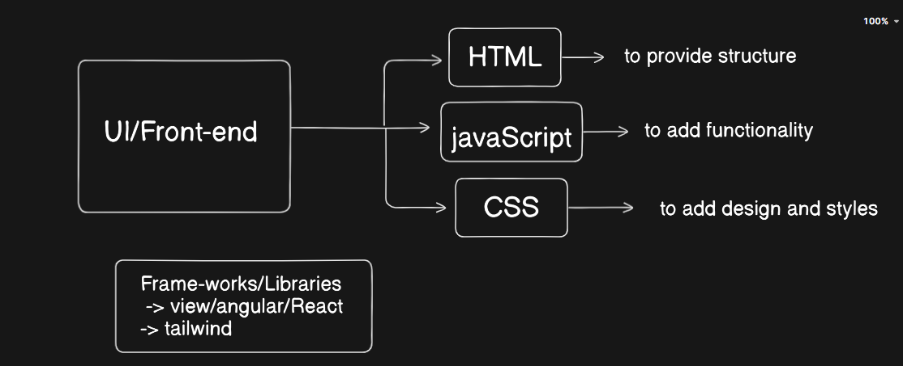

# Frontend 
Frontend in web development refers to the user-facing part of a website or application. It's everything you see and interact with directly.

Clint-side scripting deals with improving appearience and behaviour of rendring webpage

